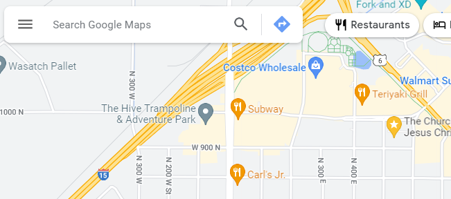

# Overview
The purpose of this activity is to build a responsive menu using JavaScript. The menu will adapt to different viewport sizes and also respond when the user clicks on a "hamburger" button (≡). In responsive design, our objective is to provide users with a positive and familiar experience.

They allow us to clean up layouts because they save space on the page.

Here is the video:
https://video.byui.edu/media/t/1_uzrqq84w

## What you need:
1. Make the button in html
2. In desktop view ensure that the nav bar shows 
3. In mobile view it muxt have ☰ hamburger menu using media query
4. Ensure that the Button is not shown 
