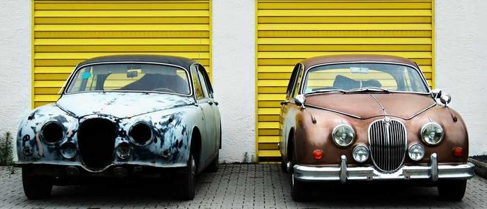

# Object fit
This is an example using this

``` css

    object-fit: contain;

```

This is an example of object contain

## Contain Value

``` css

    object-fit: contain;

```
This type of an object fit, fits the entire image but it may leave spaces behind eg:

Visually, there is supposed to be black shadows up an down

## Cover Value

``` css

object-fit: cover;

```
This type of object fit, covers the entire image. This is like making sure the photo completely covers the frame. It'll zoom in and may cut off parts of the photo to ensure no empty space is showing. The aspect ratio is still maintained.

Its still not visible to see but google

